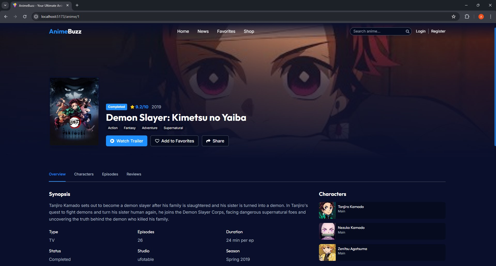

# AnimeBuzz




This is the initial version of the AnimeBuzz project. More changes and features will be added soon!

## Project Setup

- Built with [React](https://react.dev/) and [Vite](https://vitejs.dev/)
- Uses [Tailwind CSS](https://tailwindcss.com/) for styling
- Routing with [React Router](https://reactrouter.com/)

## Getting Started

1. Install dependencies:
   ```sh
   npm install
   ```
2. Start the development server:
   ```sh
   npm run dev
   ```

## License

MIT
